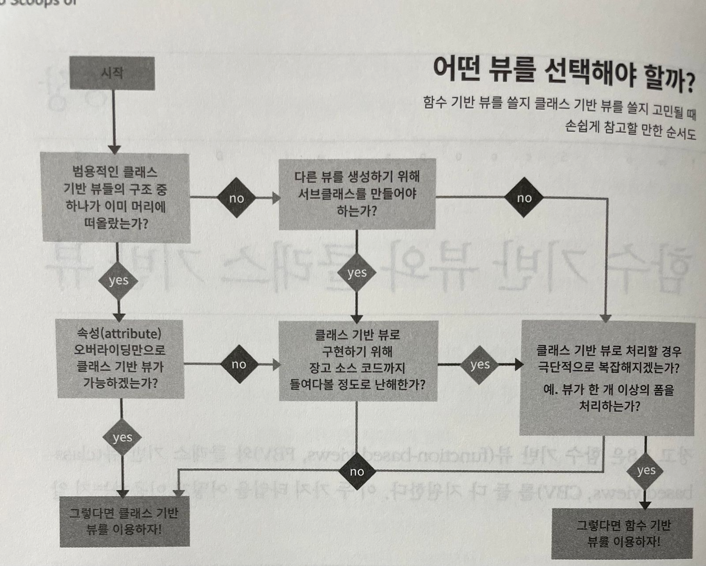

### 220310

- 모델은 크게, 유틸리티는 모듈로, 뷰는 가볍게, 템플릿은 단순하게 (Fat Models, Utility Modules, Thin Views, Stupid Template)  
  뷰와 템플릿 외의 부분에 더 많은 로직을 넣고, 템플릿 태그와 필터는 가능한 많은 내용을 가지고 있어야 한다.

- 임포트 순서  
  표준라이브러리 -> 코어 장고 -> 장고와 무관한 외부 앱 -> 프로젝트 앱

- 명시적 상대 임포트(explicit relative import)  
  from **future** import absolute_import  
  from .models import WaffleCone  
  from .forms import WaffleConeFrom  
  from .views import FoodMixin

### 220311

- 용어

1. 장고 프로젝트: 장고 웹 프레임워크를 기반으로 한 웹 애플리케이션
2. 장고 앱: 프로젝트의 한 기능을 표현하기 위해 디자인된 작은 라이브러리. 장고 프로젝트는 다수의 장고 앱으로 구성되어 있으며, 때때로 외부 장고 패키지를 지칭하기도 한다.
3. INSTALLED_APPS: 프로젝트에서 이용하려고 INSTALLED_APPS 셋팅에 설정한 장고 앱들을 지칭한다.
4. 서드 프티 장고 패키지: 파이썬 패키지 도구들에 의해 패키지화 된, 재사용 가능한 플러그인 형태로 이용 가능한 장고앱

- 앱 디자인의 황금률  
  "한 번에 한 가지 일을 하고 그 한 가지 일을 매우 충실히 하는 프로그램을 짜는 것이다" 라는 유닉스 철학을 따르면 된다.  
  즉, 각 앱이 그 앱의 주어진 임무에만 집중할 수 있어야 한다.  
  앱의 성격과 기능을 한 문장으로 설명할 수 없거나, 설명에 '그리고/또한' 이라는 단어를 사용해야 한다면 앱의 기능을 나누어야 할 때라는 뜻이다.

- PEP8 스타일 가이드  
  https://peps.python.org/pep-0008/
- 비공통 앱 모듈

1. behaviours.py: 모델 믹스인 위치에 대한 옵션
2. constants.py: 앱 레벨에서 이용되는 셋팅을 저장하는 장소. 하나의 앱에 다양한 셋팅이 있다면 각 모듈로 분리하는 것이 좋다.
3. decorators.py: 데코레이터가 존재하는 곳
4. fields.py: 폼 필드에 사용됨.
5. factories.py: 테스트 데이터 팩토리 파일
6. helpers.py: 헬퍼 함수. 뷰와 모델을 가볍게 하기 위해 뷰와 모델에서 추출한 코드를 저장한 장소. utils.py와 비슷한 기능
7. managers.py: models.py가 너무 커질 경우, 일반적인 해결책으로 모델 매니저가 여기로 이동한다.
8. signals: 커스템 시그널 제공에 대한 대안으로 커스텀 시그널을 넣는 공간
9. utils.py: helpers.py와 같다
10. viewmixins.py: 뷰 믹스인을 이 모듈로 이전함으로써 뷰 모델과 패키지를 더 가볍게 할 수 있다.

### 220312

#### 6장 모델

1. 모델이 너무 많으면 앱을 나눈다. 각 앱이 가진 모델은 5개를 넘지 않아야 한다.
2. 모델 상속에 주의한다.
3. 모델 사이 중복이 1~2개 정도라면 상속이 필요 없다.
4. 중복된 필드가 많은 경우, 공통 부분을 추상화 기초모델로 리팩토링할 수 있다.

| 상속스타일                                                                                                     | 장점                                                                                                                                                   | 단점                                                                                             |
| -------------------------------------------------------------------------------------------------------------- | ------------------------------------------------------------------------------------------------------------------------------------------------------ | ------------------------------------------------------------------------------------------------ |
| 상속 사용 x. 모델들 사이 공통필드가 존재하는 경우, 두 모델에 전부 해당 필드를 만든다                           | DB 테이블에 어떻게 매핑되든지 상관 없고, 모델을 한 눈에 이해하기 쉽다                                                                                  | 모델들 사이에서 중복되는 테이블이 많은 경우 지속적 관리에 어려움이 있다                          |
| 추상화 기초 클래스. 오직 상속받아 생성된 모델들의 테이블만 생성된다                                            | 추상화된 클래스에 공통부분을 추림으로써 한 번만 타이핑하면 된다. 추가 테이블이 생성되지 않고, 여러 테이블에 걸쳐 조인함으로 발생하는 성능저하도 없다   | 부모클래스를 독립적으로 이용할 수 없다                                                           |
| 멀티테이블 상속. 부모와 자식 모델에 대해서도 모두 테이블이 생성된다. OneToOneField는 부모와 자식간에 적용된다. | 각 모델에 매칭되는 테이블이 생성된다. 따라서 부모 또는 자식 모델 어디로든 쿼리가 가능. 부모 객체로부터 자식객체를 호출하는 것이 가능하다. parent.child | 자식 테이블에 대한 쿼리에 부모 테이블의 조인이 필요하여 부하 발생. 멀티테이블 상속은 권하지 않음 |
| 프락시 모델. 원래 모델에 대해서만 테이블이 생성된다.                                                           | 각기 다른 파이썬 작용(behavior)을 하는 모델들의 별칭을 가질 수 있다.                                                                                   | 모델의 필드를 변경할 수 없다.                                                                    |

- 모델 상속: core/models.py, flavor/models.py 참조

### 220312

#### 6장 모델

- 언제 널을 쓰고 언제 공백을 쓸 것인가

| 필드타입                                                                         | null=True로 사용하기                              | blank=True로 사용하기                                                                                          |
| -------------------------------------------------------------------------------- | ------------------------------------------------- | -------------------------------------------------------------------------------------------------------------- |
| CharField, TextField, SlugField, EmailField,CommaSeparatedIntegerField,UUIDField | 이용하지 않는다.                                  | 이용한다                                                                                                       |
| FileField, ImgageField                                                           | 이용하지 않는다                                   | 이용한다                                                                                                       |
| BooleanField                                                                     | 이용하지 않는다. 대신 NullBooleanField를 이용한다 | 이용하지 않는다                                                                                                |
| IntegerField, FloatField, DecimalField, DurationField 등                         | 해당값이 null이어도 상관없으면 사용               | 위젯에서 빈값을 받아도 상관 없으면 이용. 이런 경우 null=True와 같이 이용.                                      |
| DateTimeField, DateField, TimeField 등                                           | 해당값이 null이어도 상관없으면 사용               | 위젯에서 빈값을 받아도 상관 없거나 auto_now나 auto_now_add를 이용한다면 이용. 이런 경우 null=True와 같이 이용. |
| ForeignField, ManyToManyField, OneToOneField                                     | 해당값이 null이어도 상관없으면 사용               | 위젯에서 헤당 값이 빈값을 받아도 괜찮다면 이용                                                                 |
| GenericIPAddressField                                                            | 해당값이 null이어도 상관없으면 사용               | 위젯에서 헤당 값이 빈값을 받아도 괜찮다면 이용                                                                 |
| IPAddressFiled                                                                   | 이용하지 않음                                     | 이용하지 않음                                                                                                  |

- 범용관계와 GenericForeignKey 사용은 피한다
- 모델매니저

```python
from django.db import models
from django.utils import timezone

class PublishedManager(models.Manager):

    # 기본 매니저로 이 매니저를 정의한 모델이 있을 때 이 모델을 가리키는 모든 관계 참조에서 모델 매니저를 사용할 수 있도록 한다.
    use_for_related_fields = True

    def published(self, **kwargs):
        return self.filter(pub_date__lte=timezone.now(), **kwargs)

class FlavorReview(models.Model):
    review = models.CharField(max_length=255)
    pub_date = models.DateTimeField()

    # 커스텀 모델 매니저 추가
    objects = PublishedManager()

# 사용
>>> from reviews.models import FlavorReview
>>> FlavorReview.objects.count()
35
>>> FlavorReview.objects.published().count()
31
```

- 거대모델(Fat Models) 이해하기

데이터 관련 코드를 뷰나 템플릿에 넣기 보다는 모델 메서드, 클래스 메서드, 프로퍼티 심지어는 매니저 메서드 안에 넣어 캡슐화 하는 개념이다.  
다음과 같이 뷰나 여타의 작업에서 동일한 로직을 이용 가능하다.

1. Review.create_review(cls, user, rating, title, description): 리뷰를 생성하는 클래스 메서드. (HTML이나 REST에서 사용)
2. Review.product_average: 리뷰된 프로젝트의 평균 점수를 반환하는 프로퍼티를 정의한다.
3. Review.found_useful(self, user, yes): 해당 리뷰가 유용했는지 아닌지 사용자가 기록할 수 있는 메서드. (HTML이나 REST에서 사용)

그러나 너무 많은 로직을 모델 안에 넣으면 god object문제를 야기할 수 있다.  
메서드들과 클래스 메서드, 프로퍼티들은 유지한 채 그것들이 지닌 로직을 모델 행동(model behaviors)나 상태 없는 헬퍼 함수(stateless helper function)로 이전하기도 한다.

- 모델행동(믹스인)  
  모델 행동은 믹스인을 통한 캡슐화와 구성화의 개념으로 이루어진다. 모델은 추상화 모델로부터 로직들을 상속 받는다.

- 상태 없는 헬퍼 함수  
  모델로부터 로직을 떼어나 유틸리티 함수로 넣어 독립적으로 구성한다.
  단점은 해당 함수들이 자신의 상태를 가지지 않음으로(stateless) 함수에 더 많은 인자를 필요로 하게 된다.
- 요약

1. 모델 상속을 사용하기로 결정했다면 접합 모델(concrete model)이 아니라 추상화 기초 클래스로부터 상속하라.
2. 모델에서 null=True, blank=True옵션을 이용할 때에는 애매한 부분을 주의하라
3. django-model-utils와 django-extensions이 유용할 수 있다.
4. 거대 모델은 로직을 쉽게 캡슐화할 수 있지만 god objects를 유발할 수 있다.

### 220312

#### 7장 쿼리와 데이터베이스 레이어

- 단일 객체에서 get_object_or_404() 이용하기  
  단일 객체를 가져오는 작업 등은 get()대신에 get_object_or_404를 활용.  
  단, 뷰에서만 사용. model, form, helper function 등 view와 관련된 곳이 아닌 경우, 특정 데이터를 삭제했을 때 앱이 중단될 수 있다.  
  get_object_or_404()를 이용할 때는 try-except블록으로 예외처리를 할 필요는 없다.
- ObjectDoesNotExist와 DoesNotExist

```python
from django.core.exceptions  import ObjectDoesNotExist
from flavors.models import Flavor
from store.exceptions import OutOfStock

def list_flavor_line_item(sku):
    try:
        return Flavor.objects.get(sku=sku, quantity__gt=0)

    # Flavor모델에 대해서만 예외처리
    except Flavor.DoesNotExist:
        msg = 'We are out of {0}'.format(sku)

    raise OutOfStock(msg)

def list_any_line_item(model, sku):
    try:
        return model.objects.get(sku=sku, quantity__gt=0)

    # 어떤 모델에서 예외가 발생하더라도 잡아준다
    except ObjectDoesNotExist:
        msg = 'We are out of {0}'.format(sku)
        raise OutOfStock(msg)
```

- 여러 개의 객체가 반환되었을 때
  쿼리가 한개를 초과하는 객체를 반환할 수 있다면 MultipleObjectsReturned 예외를 활용한다.

```python
from flavors.models import Flavor
from store.exceptions import OutOfStock, CorruptedDatabase

def list_flavor_line_item(sku):
    try:
        return Flavor.objects.get(sku=sku, quantity__gt=0)
    except Flavor.DoesNotExist:
        msg = 'We are out of {}'.format(sku)
        raise OutOfStock(msg)
    except Flavor.MultipleObjectsReturned:
        msg = 'Multiple items have SKU {}. Please fix!'.format(sku)
        raise CorruptedDatabase(msg)
```

- 복잡하고 긴 쿼리는 지연연산(lazy evaluataion)을 사용한다
  지연연산은 데이터가 필요할 때까지는 장고가 sql을 호출하지 않는 것을 뜻한다.  
  한 줄에 여러 메서드와 데이터베이스의 각종 기능을 엮는 대신에, 여러 줄에 걸쳐 나눠쓸 수 있다.

```python
from django.db.models import Q
from promos.models import Promo

# Don't do this!
def fun_function(name=None):
    """유효한 아이스크림 프로모션 찾기"""
    # 너무 길게 작성된 쿼리 체인이 화면이나 페이지를 넘겨버리게 되므로 좋지 않다
    Promo.objects.active().filter(Q(name__startswith=name)|Q(description__icontain # ....

# Do this!
def fun_function(name=None):
    """유효한 아이스크림 프로모션 찾기"""
    results = Promo.objects.active()
    results = results.filter(
                Q(name__startswith=name) |
                Q(description__icontains=name)
            )
    results = results.exclude(status='melted') # 주석을 달 수 있다!
    results = results.select_related('flavors')  # 줄마다 의미를 파악하기 좋다
    return results
```

- 고급 쿼리 도구 이용하기  
   데이터베이스는 데이터 관리와 가공에서 파이썬보다 월등히 빠르기 때문에, 데이터를 호출한 후에 또다시 파이썬을 이용해 가공하는 것이 옳은 일인가? 하는 문제에 봉착한다.  
   그러므로 파이썬에서 뎅이터를 가공하기 전에, 장고의 고급쿼리 도구를 이용하여 데이터를 가공한다.

  1.  쿼리표현식  
      데이터베이스에서 읽기를 수행할 때 쿼리 표현식을 사용하여 해당 읽기가 실행되는 동안 값이나 계산을 수행할 수 있다.

      ```python
      # 평균 한 스쿱 이상을 주문한 모든 고객의 명단을 불러오는 코드

      # Don't do this!
      from models.customers import Customer

      customers = []
      for customer in Customer.objects.iterator(): # 루프를 돌며 고객 레코드 하나하나에 접근한다.
          if customer.scoops_ordered > customer.store_visits:
              customers.append(customer)
      ```

      데이터베이스 안의 모든 고객 레코드에 대해 하나하나 파이썬을 이용한 루프가 돌고 있다. 느리며 메모리를 많이 소모한다.  
       코드 자체가 경합 상황(race condition. 경합 상황. 공유 자원에 대해 여러 개의 프로세스가 동시에 접근을 시도하는 상태)에 직면한다. READ가 아닌 UPDATE에서는 데이터 분실이 생길 수 있다.

      ```python
      from django.db.models import F
      from models.customers import Customer

      customers = Customer.objects.filter(scoops_ordered__gt=F('store_visits'))
      # 위 코드는 디비 자체 내에서 해당 조건을 비교하는 기능을 가지고 있다.
      # 내부적으로 장고는 아래와 같은 코드를 실행한다.
      # SELECT * from customers_customer where scoops_ordered > store_visits
      ```

  2.  데이터베이스 함수들  
      UPPER(), LOWER(), CONCAT() 등 일반적인 데이터베이스 함수를 사용 가능하다.
      이용이 쉽고 간결하며, 비즈니스 로직을 디비로 더 많이 이전할 수 있게 되었다.
      (데이터 처리는 파이썬보다 디비가 빠르다)
      데이터베이스 함수는 쿼리표현식이기도 하다.

- 로우 SQL은 지양  
  단, 아래 상황은 쓰는 게 좋다.
  1.  로우 SQL을 이용함으로써 파이썬 코드나 ORM의 코드가 월등히 간결해지고 단축될 때
  2.  큰 데이터 셋에 적용되는 여러 QuerySet작업을 연결할 경우
- 트랜잭션  
  장고는 기본적으로 ORM이 모든 쿼리를 호출할 때마다 커밋을 한다.
  이로인해 데이터베이스 충돌이 발생할 수 있으며 이를 해결하기 위해 트랜잭션을 이용한다.  
  트랜잭션이란 둘 또는 그 이상의 업데이트를 단일화된 작업으로 처리하는 기법이다. (하나의 수정작업이 실패하면 트랜잭션의 모든 업데이트가 실패 이전 상태로 복구된다)
  이를 위해선 디비가 원자성(Atomic), 일관성(Consistent), 독립성(Isolated), 지속성(Durable)을 가져야 한다.  
  이런 특성을 ACID라고도 부른다. 1) 각각의 HTTP요청을 트랜잭션으로 처리하기

  ```python
  # settings/base.py
  DATABASES = { 'default': { # ... 'ATOMIC_REQUESTS': True, }, }
  ```

  ATOMIC_REQUESTS 설정을 통해 모든 웹 요청을 트랜잭션으로 쉽게 처리할 수 있다.  
   이 설정은 뷰에서의 모든 데이터베이스 쿼리가 보호되는 안정성을 얻을 수 있다. 그러나 성능 저하를 가져올 수 있다.  
   특정 뷰에서는 설정을 제외하고싶다면 transaction.non_atomic_requests()로 데코레이팅하는 선택을 고려해야 한다.  
   ATOMIC_REQUESTS 사용 시 또 다른 주의점으로는, 작업 처리 중 사용자에게 메일을 보냈고, 메일 발송 후에 에러가 발생하여 롤백되는 경우다.  
   이렇게 디비가 아닌 아이템에 CRUD하는 뷰를 만들 때에는 해당 뷰를 transaction.non_atomic_requests()로 데코레이팅하는 걸 고려해 보아야 한다.

  - Simple Non-Atomic View

  ```python # flavors/views.py
  from django.db import transaction
  from django.http import HttpResponse
  from django.shortcuts import get_object_or_404
  from django.utils import timezone

  from .models import Flavor

  @transaction.non_atomic_requests
  def posting_flavor_status(request, pk, status):
      flavor = get_object_or_404(Flavor, pk=pk)
      # 여기서 오토커밋 모드가 실행될 것이다. (장고 기본 설정)
      flavor.latest_status_change_attempt = timezone.now()
      flavor.save()

      with transaction.atomic():
      # 이 코드는 트랜잭션 안에서 실행된다.
      flavor.status = status
      flavor.latest_status_change_success = timezone.now()
      flavor.save()

      return HttpResponse('Hooray')
      # If the transaction fails, return the appropriate status
      return HttpResponse('Sadness', status_code=400)
  ```

- 명시적 트랜잭션 선언  
  사이트 성능을 개선하는 방법 중 하나이다.  
  트랜잭션에서 어떤 뷰와 비즈니스 로직이 하나로 엮여 있는지 명시하므로, 개발할 때 더 많은 시간을 요구한다

| 목적            | ORM 메서드                                                                    | 트랜잭션 이용 |
| --------------- | ----------------------------------------------------------------------------- | ------------- |
| 데이터 생성     | .create(), .bulk_create(), .get_or_create()                                   | O             |
| 데이터 가져오기 | .get(), .filter(), .count(), .iterate(), .exists(), .exclude(), .in_bulk, etc | X             |
| 데이터 수정하기 | .update()                                                                     | O             |
| 데이터 지우기   | .delete()                                                                     | O             |

    독립적인 ORM 메소드 호출을 트랜잭션 처리하지 말자
    장고의 ORM은 데이터의 일관성을 위해 내부적으로 트랜잭션을 이용하고 있다.
    따라서 독립적인 ORM 메서드(.create(), .update(), .delete())는 트랜잭션 처리가 유용하지 않다.
    대신 여러 ORM 메서드들을 뷰나 함수 또는 메서드 내에서 호출할 때 트랜잭션을 이용하기 바란다.

- django.http.StreamingHttpResponse와 트랜잭션  
  뷰가 django.http.StreamingHttpResponse를 반환한다면 일단 응답이 시작된 이상 트랜잭션 에러를 중간에 처리하기란 불가능하다.  
  StreamingHttpResponse에서 트랜잭션 에러를 처리하려면? 다음 중 하나를 고려하자 1) ATOMIC_REQUESTS=False로 설정, 7.7.2의 기술을 고려 2) 뷰를 django.db.transaction.non_atomic_requests 데코레이터로 감싸본다.

트랜잭션은 뷰에서만 적용된다. 스트림 응답이 SQL쿼리를 생성했다면? 오토커밋으로 동작한다.

### 8장 함수 기반 뷰와 클래스 기반 뷰

- 함수 뷰와 클래스 뷰 중 어느 것을 선택해야 하는가?
  
- 클래스뷰의 나쁜 예시

```python
from django.urls import path
from django.views.generic import DetailView

from tastings.models import Tasting

urlpatterns = [
    path('<int:pk>',
        DetailView.as_view(
            model=Tasting,
            template_name='tastings/detail.html'),
        name='detail'),
    path('<int:pk>/results/',
        DetailView.as_view(
            model=Tasting,
            template_name='tastings/results.html'),
        name='results'),
]
```

이 코드는 장고의 디자인 철학에 어긋난다.

1. 뷰와 url, 모델 사이에 느슨한 결합(loose coupling)대신 단단하게 종속적인 결합(tight coupling)이 되어 있다. 즉, 뷰에서 정의된 내용이 재사용이 어렵다.
2. 클래스 기반 뷰들 사이에서 같거나 비슷한 인자들이 계속 이용된다. DRY(Don't Repeat Yourself)철학에 위배된다.
3. URL들의 무한한 확장성이 파괴되었다. 이 안티패턴을 사용함으로써 클래스 상속이 불가능해졌다.

- URLConf에서 느슨한 결합 유지하기

```python
# testings/views.py
from django.urls import reverse
from django.views.generic import ListView, DetailView, UpdateView

from .models import Tasting

class TasteListView(ListView):
    model = Tasting

class TasteDetailView(DetailView):
    model = Tasting

class TasteResultsView(TasteDetailView):
    template_name = 'tastings/results.html'

class TasteUpdateView(UpdateView):
    model = Tasting

    def get_success_url(self):
        return reverse('tastings:detail', kwargs={'pk': self.object.pk})
```

```python
# testings/urls.py
from django.urls import path

from . import views

urlpatterns = [
    path(
        route='',
        view=views.TasteListView.as_view(),
        name='list'
    ),
    path(
        route='<int:pk>/',
        view=views.TasteDetailView.as_view(),
        name='detail'
    ),
    path(
        route='<int:pk>/results/',
        view=views.TasteResultsView.as_view(),
        name='results'
    ),
    path(
        route='<int:pk>/update/',
        view=views.TasteUpdateView.as_view(),
        name='update'
    )
]
```

위 방법은 아래와 같은 이유로 더 낫다

1. 반복되는 작업 하지 않기: 뷰들 사이에서 인자나 속성이 중복 사용되지 않는다
2. 느슨한 결합: URLConf로부터 모델과 템플릿이름을 제거함으로서 뷰는 뷰이고 URLConf는 URLConf이게 되었다. 하나 이상의 URLConf에서 정의된 뷰의 호출이 가능해졌다.
3. 한번에 한 가지씩 업무를 명확하고 매끄럽게 처리: 뷰의 로직을 찾기 위해 뷰나 URLConf를 둘 다 뒤지지 않아도 된다.
4. 클래스 기반의 장점을 살린다: 뷰 모듈에서 표준화된 정의를 가지게 됨으로써 다른 클래스에서도 우리의 뷰를 상속해서 사용할 수 있다.
5. 무한한 유연성: 뷰 모듈에서 표준화된 정의를 구현함으로 커스텀 로직을 구현 가능하다.

- URL 이름공간 이용하기  
  path의 name은 위처럼 tastings_detail이나 tastings_result이 아니다.  
  앱이나 모델 이름이 빠진 detail이나 results같은 명확한 이름을 갖는다
  tastings같은 앱 이름을 입력할 필요가 없어졌다.

```python
urls.py
urlpatterns += [
    path('tastings/', include('tastings.urls', namespace='tastings')), # 8.3절의 tasting/urls.py로 연결됨
]
```

```python
# tastings/views.py snippet
class TasteUpdateView(UpdateView):
    model = Tasting

    def get_success_url(self):
        return reverse('tastings:detail', kwargs={'pk': self.object.pk})
```

```html
 Tastings 
<ul>
  
  <li>
    <a href="">{{ taste.title }}</a>
    <small> (<a href="">update</a>) </small>
  </li>
  
</ul>

```

- 서드 파티 라이브러리와 상호 운영성 높이기  
  URL이름을 <my_app>\_detail 등의 방법으로 부르면 <my_app> 부분이 겹쳐서 문제가 될 수 있다.  
  이 때 URL 이름 공간을 통해 이를 해결할 수 있다.  
  다음은 두개의 contact앱이 있을 때, namespace를 통해 해결해보는 코드다.

```python
# urls.py at root of project
urlpatterns += [
    path('contact/', include('contactmonger.urls', namespace='contactmonger')),
    path('report-problem/', include('contactapp.urls', namespace='contactapp')),
]
```

contact.html

```html
 Contact 
<p>
  <a href="">Contact Us</a>
</p>
<p>
  <a href="">Report a Problem</a>
</p>

```

namespace를 이용해서 이름을 지정하고 contact.html에서 지정한 이름으로 호출하고 있다.

- 뷰에서 비즈니스 로직 분리하기

1. 비즈니스 로직을 뷰에다 구현한다면? PDF를 생성하거나 REST API를 추가하거나 혹은 다른 포맷을 지원해야 하는 경우에 장애로 대두될 수 있다.
2. 때문에 모델 메서드, 매니저 메서드 또는 일반적인 유틸리티 헬퍼 함수들을 이용하는 전략을 선호하게 되었다.
3. 비즈니스 로직이 재사용 가능한 컴포넌트가 되고 이를 뷰에서 호출하면 확장성이 좋아진다.
4. 처음에는 비즈니스 로직이 포함될 수 있다. 하지만 뷰에서 표준적으로 이용되는 구조 이외에 덧붙여진 비즈니스 로직이 보인다면 해당 코드를 이동시키자.

- 장고의 뷰와 함수
  장고의 뷰는 HTTP 요청 객체를 받아 HTTP를 응답라는 객체로 변경하는 함수다. 수학의 함수와 개념상 비슷하다.

```python
# 함수로서의 장고 함수 기반 뷰
HttpResponse = view(HttpRequest)

# 기본 수학식 형태로 풀이 (remember functions from algebra?)
y = f(x)

# ... 그리고 이를 CBV 예로 변경해 보면 다음과 같다
HttpResponse = View.as_view()(HttpRequest)
```

- 뷰의 기본 형태들  
  기본형태가 중요한 이유

1. 한 기능만 따로 떼어놓은 관점이 필요할 떼가 있다
2. 가장 단순한 장고 뷰를 이해했다는 것은 장고 뷰의 역할을 명확히 이해했다는 것이다
3. 함수 기반 뷰는 HTTP method 중립이지만 Django CBV는 특정 HTTP method의 선언이 필요하다는 것을 알 수 있다. (get, post ..)

```python
from django.http import HttpResponse
from django.views.generic import View

# 함수 기반 뷰의 기본 형태 (FBV)
def simplest_view(request):
    # 비즈니스 로직이 여기에 위치한다.
    return HttpResponse('FBV')

# 클래스 기반 뷰의 기본 형태 (CBV)
class SimplestView(View):
    def get(self, request, *args, **kwargs):
        # 비즈니스 로직이 여기에 위치한다.
        return HttpResponse('CBV')
```

- locals()를 Views Context에 이용하지 말자  
  locals()를 호출형으로 반환하는것은 안티패턴이다.  
  시간을 단축할것같지만 더 긴 시간을 허비하는 결과를 초래한다.  
  유지보수가 힘들다. 뷰가 어떤것을 반환하려고 하는지 명확하게 파악하기가 힘들다.

```python
# Don't do this!
def ice_cream_store_display(request, store_id):
    store = get_object_or_404(Store, id=store_id)
    date = timezone.now()
    return render(request, 'melted_ice_cream_report.html', locals())
```

```python
# Don't do this!
def ice_cream_store_display(request, store_id):
    store = get_object_or_404(Store, id=store_id)
    now = timezone.now()
    return render(request, 'melted_ice_cream_report.html', locals())
```

다음과 같이 명시적인 context를 사용하라.

```python
def ice_cream_store_display(request, store_id):
    return render(
        request,
        'melted_ice_cream_report.html',
        {
            'store': get_object_or_404(Store, id=store_id),
            'now': timezone.now()
        }
    )
```

- 요약  
  뷰 코드는 views.py모듈에, URLConf코드는 앱의 urls.py모듈에 소속되어야 한다.  
  클래스 기반 뷰를 사용하면 객체 상속을 이용함으로써 코드를 재사용하기 쉬워지고 디자인을 유연하게 할 수 있다.

### 9장 함수 기반 뷰의 모범적인 이용

- 함수 기반 뷰의 가이드라인

1. 뷰 코드는 작을수록 좋다.
2. 뷰에서 절대 코드를 반복해서 사용하지 말자.
3. 뷰는 프레젠테이션(presentation) 로직을 처리해야한다. 비즈니스 로직은 가능한 모델(Model) 로직에 적용시키고 만약 해야 한다면 폼 안에서 내재시켜야 한다.
4. 뷰를 가능한 한 단순하게 유지하라.
5. 03, 404, 500을 처리하는 커스텀 오류 처리기를 작성하라.
6. 복잡하게 중첩된 if 블록 구문은 피하라.
